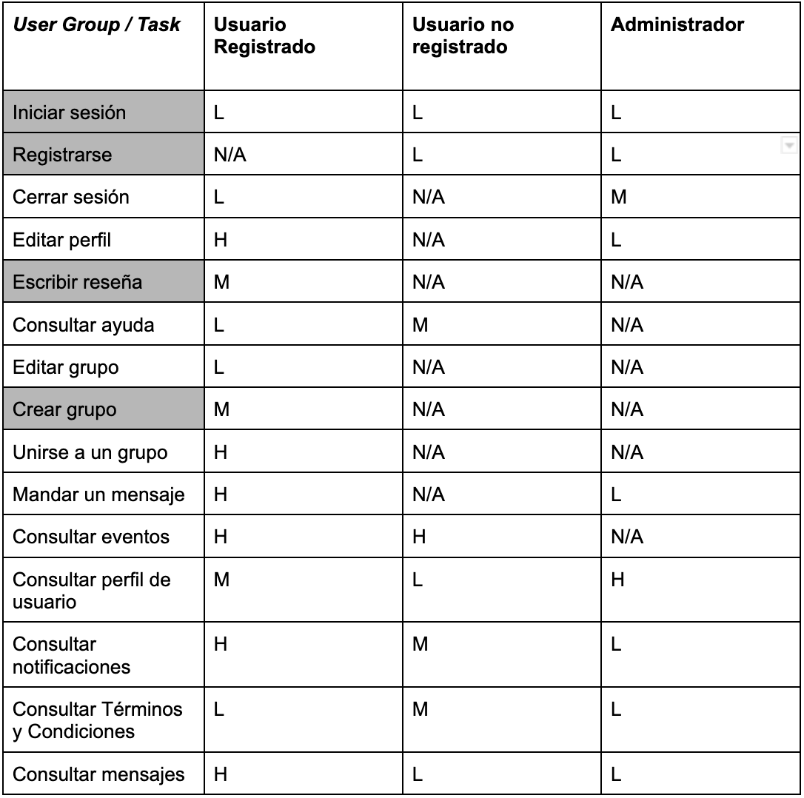
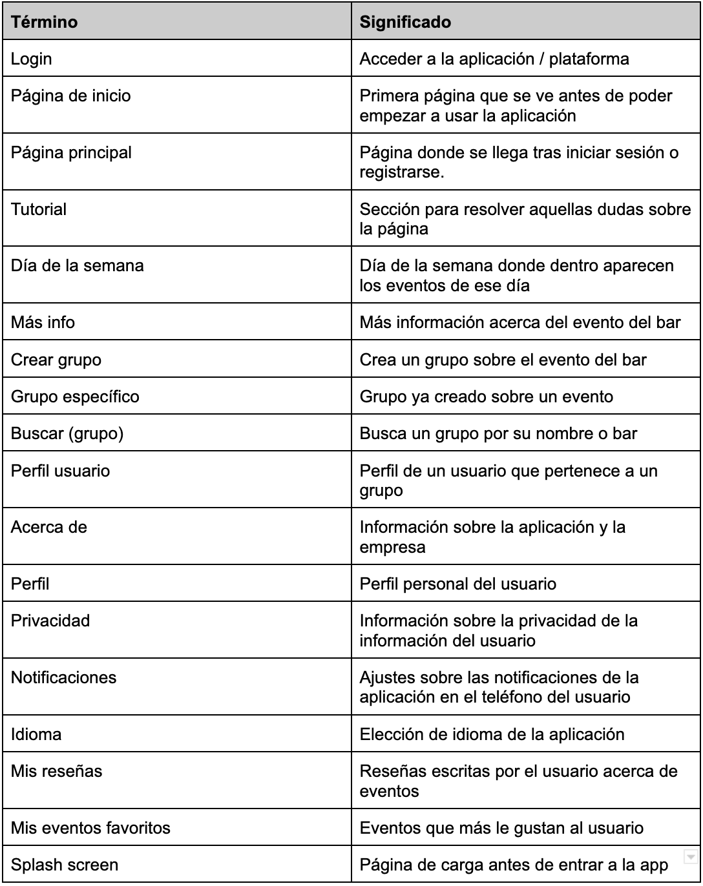
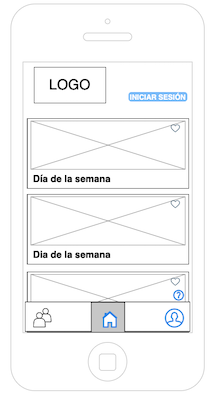
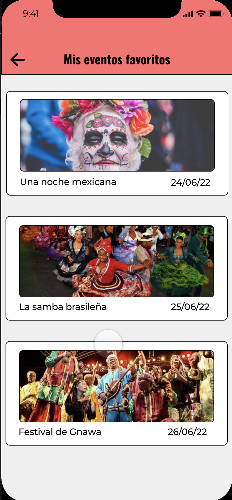

# DIU22
Prácticas Diseño Interfaces de Usuario 2021-22 (Tema: Hostels) 

Grupo: DIU2_nombreJA.  Curso: 2021/22 
Updated: 17/5/2022

Proyecto: Cultural Week

Descripción: 

Propuesta de promoción del music bar & restaurant del Hostel Carlota Braun Granada que permite a los usuarios disfrutar junto a gente de gustos afines, de una semana al mes con comidas tradicionales de diversos países con el fin de variar del tapeo típico granadino.

Logotipo: 

Miembros
 * :bust_in_silhouette:   Jose Jiménez Cazorla     :octocat:     
 * :bust_in_silhouette:  Alberto Llamas González     :octocat:

----- 

# Proceso de Diseño 

## Paso 1. UX Desk Research & Analisis 

 1.a Competitive Analysis
-----
| Características de la página web y el hostel  | CarlotaBraun  | 2060 Hostel  | Zero Barcelona  |
|---|---|---|---|
| Traducción a otro idioma disponible  | Sí, además se puede traducir a más de un idioma | Sí  | Sólo está en inglés |  
| Facilidad de lectura  | Cuesta leer el texto de la portada pero el resto se lee bien | Sí | Sí  |
| Redes Sociales |  Sí | Sí | Sí |
| Imágenes del hostel | Sólo de habitaciones  | Sí  |  Sí |
| FAQ |  Sí, además proporciona un número de teléfono para enviar un Whatsapp | No  | Sí  |
| Pagina Web intuitiva |  Sí | Sí  |  Sí |
| Informa sobre protocolos COVID | No  | No  | Sí  |
| Blog actualizado | Sí | No  | No |
| Reserva en web | Sí, en página externa | Sí, en la propia web del hostel  |  Sí, en la propia web del hostel |
| Wifi|  Sí | Sí  | Sí  | 
| Habitacion solo para chicas | Sí  | No, sólo habitaciones mixtas  | Sí  |
| Lavadora y Secadora | Sí | Sí  | Sí  |
| Recepción 24h | No informa si es 24h  | No informa si es 24h  | Sí  |
| Guardaequipajes / Taquillas | Sí  | Sí  |  Sí |
| Ecológico |  No informa | Sí  |  No informa |
| Bar/Restaurante | MusicBar  | RoofBar  | Café Bar  |
| Cocina | No  | Sí  | Sí  |
| Precio más barato por noche | 12€ en habitación de 6 personas  | 34€ en habitación de 12 personas  | 15€ en habitación de 10 personas |

Hemos analizado dos opciones con mejor valoración que Carlota Braun Hostel para ver si había mucha diferencia entre ellos. Como podemos ver, Carlota Braun no se diferencia de los otros hostels con mejor valoración ya que dispone de los mismos servicios por un precio mucho más asequible en una habitación con menos personas. 

 1.b Persona
-----

Nacho encaja en el tipo de persona que podría alojarse en un hostel ya que es muy extrovertido, le encanta viajar, conocer gente nueva y compartir sus experiencias personales con sus seguidores. Lucía sin embargo, es un poco más introvertida y es otro tipo de cliente posible de un hostel, un grupo de amigas que busca pasárselo bien sin gastar mucho dinero en alojamiento.

 1.c User Journey Map
----

Para Lucía decidimos que realizase una experiencia más común para personas como nosotros, que no conocíamos el concepto de hostel. Preguntando a amigos por sus experiencias y buscando información por Internet, enfrentándose ella misma a los problemas que pudiesen surgir. En el caso de Nacho, podemos ver que gracias a su agencia de social media ha obtenido un gran
viaje calidad/precio. Antes de esto ha intentado organizarlo por su cuenta pero ha tenido varios problemas a pesar de su gran manejo en las nuevas tecnologías. Estos problemas han sido: la disponibilidad de hostels y la "traición" de su 
amigo/compañero de profesión.

 1.d Usability Review
----
>>> - Enlace al documento: https://github.com/albertollamass/DIU/blob/master/P1/Usability-review-template.xlsx
>>> - Valoración final (numérica): 84/100 
>>> - Comentario sobre la valoración: La web en general tiene buena usabilidad y permite que los usuarios realicen su reserva fácilmente aunque el nombre de dominio de la web debería de ser un poco más intuitivo y consideramos que los tiempos de carga de las páginas son muy altos y empeoran la experiencia del usuario.

## Paso 2. UX Design  

 2.a Feedback Capture Grid / EMpathy map / POV
----

 **Interesante** | **Críticas**     
| ------------- | -------
Interacción social (Conocer gente nueva) | Seguridad: Dar mayor seguridad a las cuentas de los usuarios
Ampliación de la cultura musical (Nuevos artistas / Nuevos estilos musicales) | Está destinada a personas que le guste socializar.
Innovación ( No hay otras apps que ofrezcan estos contenidos) | Hay un poco de temor a que vayas a uno de los bares y que la propuesta que ofrecen no sea buena.
Diseño atractivo | La URL de Carlota Braun es poco intuitiva (Si quieres acceder al sitio web a través de ella)
Los ítems de la app están bien localizados y es muy sencillo acceder a ellos. |
Eventos actualizados cada semana | 
| |
 **Preguntas** | **Nuevas ideas**
¿Es complicado eliminar la cuenta de usuario? | Notificaciones de cuando se produzcan cambios en la app.
¿Está garantizada la seguridad de mis datos personales? | Avisos de los protocolos COVID19 del local
¿Hay alguna forma de guardar los eventos que te han gustado? | Añadir una opción que permita a los usuarios calificar los eventos a los que han asistido
¿Hay alguna forma de que te notifique cuando sale un nuevo evento? | Tutorial de uso por primera vez 
¿Es posible contactar con un administrador de forma rápida ? | Usar un traductor propio en vez de Google Translate

  
    
La aplicación tendrá como fin dar una alternativa a la propuesta cultural del Carlota Braun. Proponemos una aplicación que exponga una Cultural Week en la que cada día de la semana se realizarían distintos eventos, con el fin de llamar la atención de los usuarios que quieren conocer culturas nuevas o usuarios extranjeros que quieran recordar de donde vienen. 

 2.b ScopeCanvas
----

 2.b Tasks analysis 
-----

 
 2.c IA: Sitemap + Labelling 
----
## SITEMAP

## LABELLING

 2.d Wireframes
-----
## SPLASH SCREEN

## INICIO DE SESIÓN

## PÁGINA PRINCIPAL

## EVENTO

### Más información

### Reseña y valoraciones

## GRUPOS

## PERFIL

### Configuración

## Paso 3. Mi UX-Case Study (diseño)

 3.a Moodboard
-----

En el Moodboard se perfilan ideas, estilos para definir el las pautas principales del diseño visual, donde podemos destacar. La información acerca de la paleta de colores y tipografía se encuentra en [Guidelines](#colores-y-tipografía):

* **Imágenes inspiradoras**

Las imágenes que nos han inspirado en el diseño del logo son imágenes que representan a diferentes países con sus respectivas culturas y platos típicos que acaban estando todos unidos en la misma mesa, representando esa mesa para nosotros la Cultural Week y la experiencia que vivirán los comensales.

* **Logotipo**

Para diseñar el logotipo, hemos partido de los colores y el tipo de fuente usados en la página principal de Carlota Braun que nos ha permitido diseñar un imagotipo sencillo, acorde a la estética de la web y que engloba lo que se quiere transmitir con la _'Cultural Week'_. Se ha creado usando la herramienta Adobe Photoshop, utilizando iconos de los que hablaremos a continuación. La imagen permite usarse como imagen de perfil en redes sociales como Facebook, Twitter o Instagram.

* **Iconos**

Para los iconos hemos utilizado los de la web [Ionic](https://ionic.io/ionicons) ya que nos parecían simples y atractivos para todo el mundo. Entre los utilizados, tenemos:

 

 

  3.b Landing Page
----

### PÁGINA 1: Portada atractiva al usuario con el logo de la propuesta y enlace a la descarga de la app

### PÁGINA 2: Información sobre la propuesta y enlace a web oficial de Carlota Braun

### PÁGINA 3: Imágenes de platos culturales para llamar atención de usuario

### PÁGINA 4: Formulario de contacto

### Simulacion

  3.c Guidelines
----
## Colores y tipografía
* **Paleta de colores**

Para obtener la paleta de colores hemos utilizado la herramienta [StilifyMe](http://stylifyme.com/). Nos permite introducir la url de una página web y nos devuelve los colores principales utilizados por ella. Como podemos comprobar visitando la web de [Carlota Braun](hostel-granada.es), tiene tonos rojizos, negros y grises por lo que utilizaremos dichos colores en el mockup. En nuestro caso obtuvimos:

* **Tipo de fuente**

Para seleccionar las fuentes, también utilizamos [StilifyMe](http://stylifyme.com/) aunque hemos decidido cambiar Montserrat que es la fuente que utiliza Carlota Braun para párrafos por  Oswald ya que nos parecía más apropiada.

> Si se desea encontrar más información acerca del logotipo, íconos e imágenes inspiradoras, se puede ver en el [MoodBoard](#paso-3-mi-ux-case-study-diseño)

### Patrones de diseño
Para definir los patrones de diseño que utilizaremos hemos extraído información de https://material.io/ y https://ui-patterns.com/patterns.

* Para que el usuario navegue entre las diferentes pestañas (perfil, grupos y home), se utiliza el patrón [Bottom Navigation Bar] (https://material.io/components/bottom-navigation).
* Para el botón del tutorial se utiliza el patrón [Floating Action Button](https://material.io/components/buttons-floating-action-button).
* Para movernos entre las partes de la pestaña home, perfil o grupos se utiliza el patrón [Tabs](https://material.io/components/tabs).
Como patrones de búsqueda se ha utilizado: 
* Para la búsqueda de idioma y de grupo se ha utilizado el patrón [Autocompletar](https://ui-patterns.com/patterns/Autocomplete) ya que facilita al usuario encontrar lo deseado y mejora su UX al no tener que escribir el nombre completo del grupo o idioma.

  3.d Mockup
----
Para realizar el diseño, han sido de utilidad los wireframes realizados anteriormente ya que básicamente sólo hemos tenido que cambiar el formato de las páginas.

| **Home** | **Iniciar sesión** | **Registrarse** |
|---|---|---|
|  | |  |
| **Evento día semana** | **Evento día semana** | **Todas las reseñas**|
|  | |  |
| **Escribe tu reseña** | **Grupos** | **Crear grupo** |
|  | |  |
| **Grupo específico** | **Editar grupo** | **Perfil de usuario** |
|  | |  |
| **Editar perfil** | **Mis reseñas** | **Mis eventos favoritos** |
|  | |  | 
| **Configuración** | **Idiomas** | **Notificaciones** |
|  | |  |
| **Privacidad** | **Acerca de** | **Splash Screen** |
|  | |  |

 3.e ¿My UX-Case Study?
-----

>>> Publicar my Case Study en Github..
>>> Documente y resuma el diseño de su producto en forma de video de 90 segundos aprox

## Paso 4. Evaluación 

 4.a Caso asignado
----

>>> Breve descripción del caso asignado con enlace a  su repositorio Github

 4.b User Testing
----

>>> Seleccione 4 personas ficticias. Exprese las ideas de posibles situaciones conflictivas de esa persona en las propuestas evaluadas. Asigne dos a Caso A y 2 al caso B
 

| Usuarios | Sexo/Edad     | Ocupación   |  Exp.TIC    | Personalidad | Plataforma | TestA/B
| ------------- | -------- | ----------- | ----------- | -----------  | ---------- | ----
| User1's name  | H / 18   | Estudiante  | Media       | Introvertido | Web.       | A 
| User2's name  | H / 18   | Estudiante  | Media       | Timido       | Web        | A 
| User3's name  | M / 35   | Abogado     | Baja        | Emocional    | móvil      | B 
| User4's name  | H / 18   | Estudiante  | Media       | Racional     | Web        | B 

. 4.c Cuestionario SUS
----

>>> Usaremos el **Cuestionario SUS** para valorar la satisfacción de cada usuario con el diseño (A/B) realizado. Para ello usamos la [hoja de cálculo](https://github.com/mgea/DIU19/blob/master/Cuestionario%20SUS%20DIU.xlsx) para calcular resultados sigiendo las pautas para usar la escala SUS e interpretar los resultados
http://usabilitygeek.com/how-to-use-the-system-usability-scale-sus-to-evaluate-the-usability-of-your-website/)
Para más información, consultar aquí sobre la [metodología SUS](https://cui.unige.ch/isi/icle-wiki/_media/ipm:test-suschapt.pdf)

>>> Adjuntar captura de imagen con los resultados + Valoración personal 

 4.d Usability Report
----

>> Añadir report de usabilidad para práctica B (la de los compañeros)

>>> Valoración personal 

>>> ## Paso 5. Evaluación de Accesibilidad  (no necesaria)

>>>   5.a Accesibility evaluation Report 
>>>> ----

>>> Indica qué pretendes evaluar (de accesibilidad) sobre qué APP y qué resultados has obtenido 

>>> 5.a) Evaluación de la Accesibilidad (con simuladores o verificación de WACG) 
>>> 5.b) Uso de simuladores de accesibilidad 

>>> (uso de tabla de datos, indicar herramientas usadas) 

>>> 5.c Breve resumen del estudio de accesibilidad (de práctica 1) y puntos fuertes y de mejora de los criterios de accesibilidad de tu diseño propuesto en Práctica 4.

## Conclusión final / Valoración de las prácticas

>>> (90-150 palabras) Opinión del proceso de desarrollo de diseño siguiendo metodología UX y valoración (positiva /negativa) de los resultados obtenidos  

